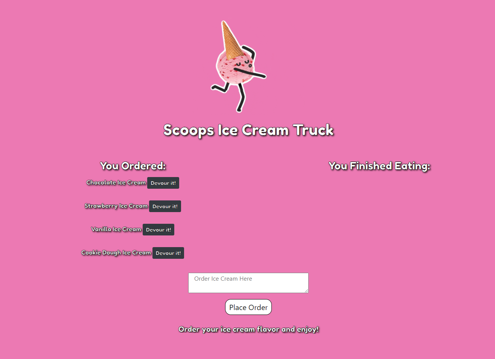
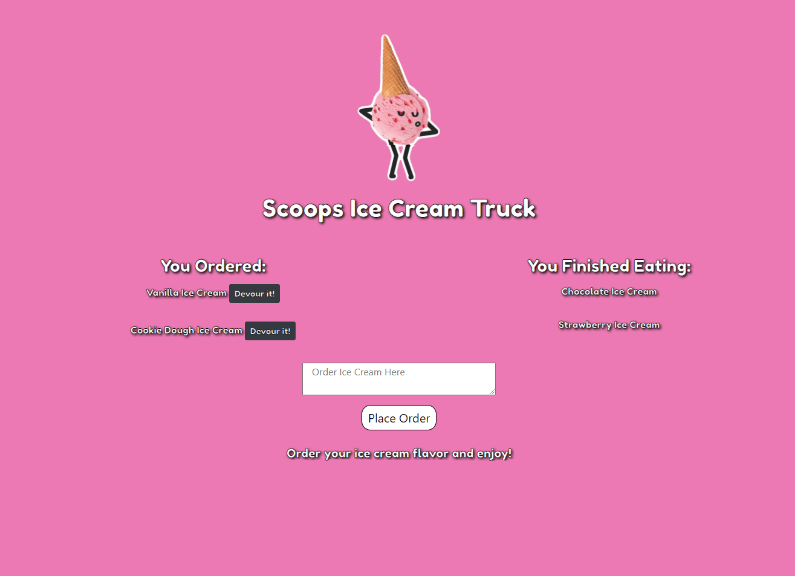

# 🍦 Scoops Ice Cream Truck

[CLICK HERE FOR LIVE HEROKU APPLICATION](https://ice-cream-truck.herokuapp.com/)

## Table of Contents
* [Screenshots](#screenshots)

* [Application Description](#application-description)

* [Installation](#installation)

* [Usage](#usage)

* [Demo](#demo)

* [Built With](#built-with)

* [License](#license)

* [Questions](#questions)

## Screenshots 



## Application Description

A ice cream logger app with MySQL, Node, Express, Handlebars and a homemade ORM that lets users input the names of ice cream flavors they'd like to eat. Whenever a user submits a ice cream flavor, the app will display the ice cream flavor on the page.
Each ice cream flavor in the waiting area also has a Devour button. When the user clicks Devour, the ice cream will move to the right side of the page. This app stores every ice cream in a database, whether devoured or not.

## Installation 
```
npm i 
```

## Usage 
```
Run "node server.js" to start then navigate to a browser window to localhost:3030

OR
                                     
Use the live application via the Heroku link provided above

```
## Demo


## Built With
* Heroku
* MySQL
* Express
* Node
* Handlebars 
* ORM
* JSON
* JQuery 
* Bootstrap

## License
[](https://opensource.org/licenses/MIT)

Copyright 2020 ©Kristy Keller

<sup>Permission is hereby granted, free of charge, to any person obtaining a copy of this software and associated documentation files (the "Software"), to deal in the Software without restriction, including without limitation the rights to use, copy, modify, merge, publish, distribute, sublicense, and/or sell copies of the Software, and to permit persons to whom the Software is furnished to do so, subject to the following conditions:
  
<sup>The above copyright notice and this permission notice shall be included in all copies or substantial portions of the Software.
  
<sup>THE SOFTWARE IS PROVIDED "AS IS", WITHOUT WARRANTY OF ANY KIND, EXPRESS OR IMPLIED, INCLUDING BUT NOT LIMITED TO THE WARRANTIES OF MERCHANTABILITY, FITNESS FOR A PARTICULAR PURPOSE AND NONINFRINGEMENT. IN NO EVENT SHALL THE AUTHORS OR COPYRIGHT HOLDERS BE LIABLE FOR ANY CLAIM, DAMAGES OR OTHER LIABILITY, WHETHER IN AN ACTION OF CONTRACT, TORT OR OTHERWISE, ARISING FROM, OUT OF OR IN CONNECTION WITH THE SOFTWARE OR THE USE OR OTHER DEALINGS IN THE SOFTWARE.

## Questions

If you have any questions regarding this repo, please contact me at the following:

* <keller.kristy@outlook.com>

* [KristyKeller](https://github.com/KristyKeller)
